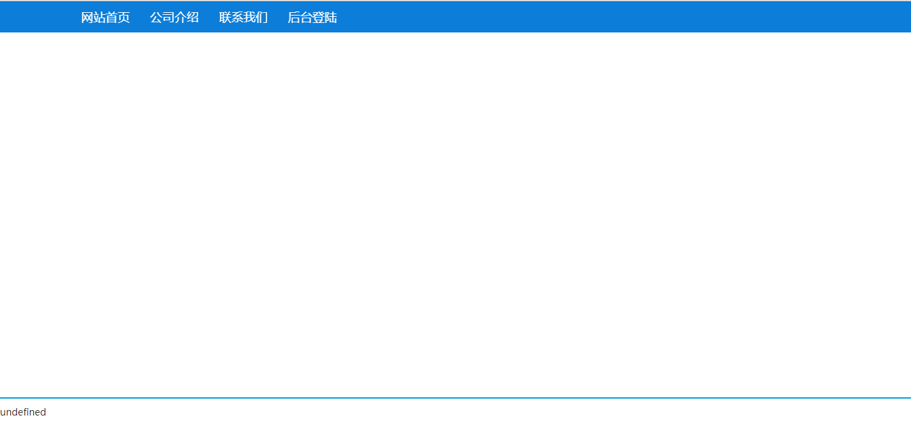
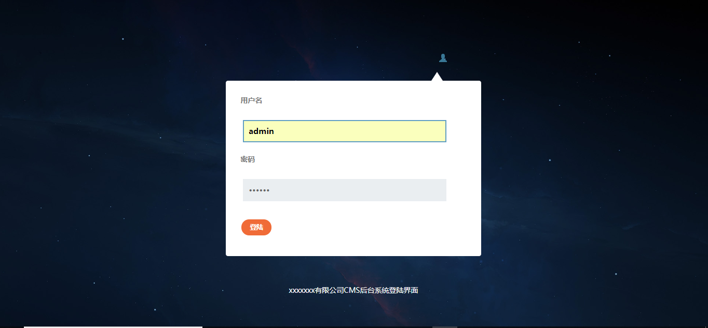
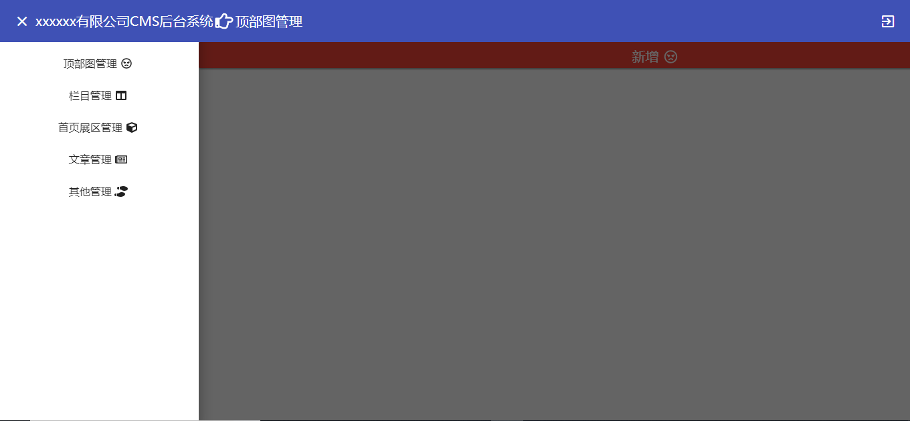

# Myportal
##Description
**动态门户网站**
- 框架： Angular 5.2
- 初始化工具：[angular-cli 1.7.3](https://github.com/angular/angular-cli)
- 项目组织结构： see [here](https://www.processon.com/view/link/5b84a4b7e4b075b9fe2a2380)

>实现了栏目、首页展区、文章等其他基本功能,实现数据双向绑定以及展区样式动态化。


## The package(包依赖)
**angular cli**自动依赖的包我就不介绍了，这里讲下我手动添加的第三方包
- [Angular Materrial 5.2](https://material.angular.io/)：angular ui库，本项目的后台管理采用了该库，官网最近抽风了访问不了。
- [Angular Flex-Layout](https://github.com/angular/flex-layout) : angular 弹性布局库，前台首页展区部分的动态化就利用该库实现
- [Froala](https://www.froala.com/wysiwyg-editor): 国外一款富文本编辑库，比什么UEditor强大一百倍
- [angular-fontawesome](https://github.com/FortAwesome/angular-fontawesome): 开发angular 必备的icon库

## Environment（环境）
- node 8.11.3
- npm 6.4.1
- angular-cli 1.7.3
- typescript 2.5.3
>在**npm install** 之前，请确保系统里全局安装了这些环境，为了避免不可预知的错误，版本尽量一致。
## Install
````
git clone https://github.com/Cloudintheking/myportal.git yourdir
cd youdir
npm i
````
>PS：在公司电脑上 `npm i`时没问题，到自己电脑上却给我报了个错误npm ERR! Error: EPERM: operation not permitted没有操作权限，没办法只能用管理员身份进入**cmd**运行成功。然后我把包删除了,用用户身份进入**cmd**运行npm i,也成功了，真是莫名其妙

## Serve
run  `ng serve -e test` //启动测试模式

run  `ng serve -e prod` //启动生产模式

then open [http://localhost:4200](http://localhost:4200)

PS: 运行该命令前,请先克隆[myportal服务端项目](https://github.com/Cloudintheking/myportal_server)并启动后端服务
##Page Introduction
###前台首页

>现在数据还都是空的
###登录页

>用户名：admin 密码：123456

>登录接口被我注释了，实际开发中登录是要经过服务器验证的，这里只作演示

###后台管理页

>目前只写了6个管理功能
- 顶部图管理：控制前台页面顶部轮播图的crd
- 栏目管理： 控制栏目分类的crud,注意栏目可以多级
- 首页展区管理：控制首页展区的crud,首页展区关联栏目,因关联栏目的变化而变化
- 文章关联： 控制文章的crud,文章关联栏目
- 其他管理： 剩余的一些管理，比如前台页底部的链接crud、网站版权、公司介绍、联系我们等
>前台页面最终展示效果根据添加数据的不同而产生变化，所以不多说了，自己去探索吧
## Build

run `ng build -e test` //生成测试模式下站点文件

run `ng build -e prod` //生成生产模式下站点文件

## Further help
如果安装或是启动过程中遇到什么问题，欢迎到**issue**或**huanghking@gmail.com**里留言。最后,如果你觉着项目写的还可以,记得star额~
